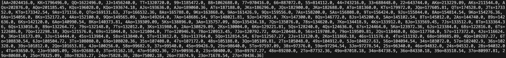

# Poker Hand Win Frequency Simulator

This poker simulator was made for my friend Eli in order to spare him the effort of simulating hands manually.

The simulator determines the winning hand based on the assumption that all 5 community cards are face-up.

The raw frequencies are normalized to account for the differing probabilities of each pocket combination.  For example, a pair is less probable than 2 suited cards (1/17 to 1/4), so the raw frequency of pocket aces will likely be less than the raw frequency of suited QJ, however, in practice, AA is a stronger hand when it does show up, thus the results are normalized to account for this.

## How to Use
Compile and run the `Poker.java` file.  You will be prompted for the number of players and rounds of simulation to perform in the CLI.

Results will be outputted in a list of frequencies.  Divide the frequency by the number of simulations to get the win percentage of that pocket.

## Credits

This poker simulator uses Jarkko Piiroinen's hand evaluator which implements Kevin Suffecool's 5-card hand evaluator,
with the perfect hash optimization by Paul Senzee.
